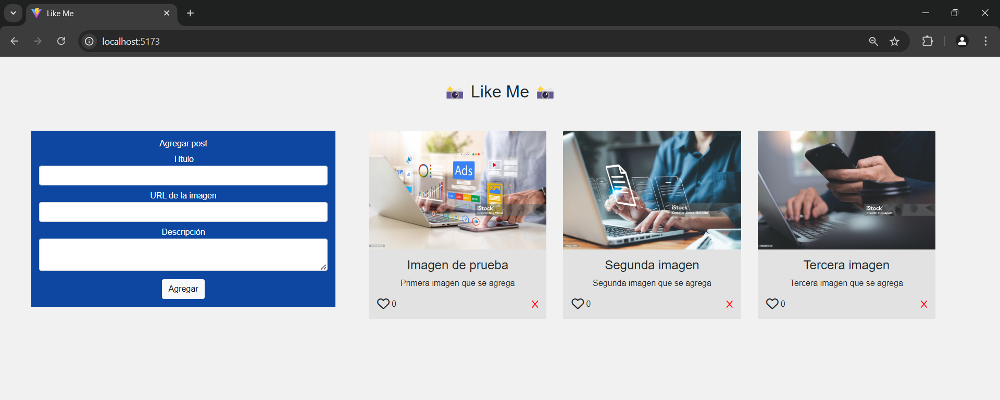

# Módulo 6 Acceso a BDD con Node y el paquete pg Parte 1 - Desafío 3 Like Me

## Presentación del Desafío

##  

## Descripción del PY ⌨️

La red social “Like Me” está apenas iniciando el proceso de desarrollo, se encuentra
estudiando el mercado y analizando la competencia y ha descubierto que el éxito de esta
industria se enfoca en los likes de los posts emitidos por los usuarios, por lo que decidió
iniciar con el desarrollo de la lógica correspondiente a la creación de posts y a la interacción
de likes que este puede tener. Como desarrollador full stack developer de la empresa “Like Me”
crearé un servidor que disponibilice las rutas GET y POST para consultas y guardar los posts en
una base de datos PostgreSQL con el paquete pg.

## Requerimientos entregados:

1. Cree la BDD y la tabla.
2. Habilité CORS en el servidor: instalé Express, pg y cors en el proyecto (npm install express pg cors)
3. Cree un archivo llamado server.js para manejar el servidor.
4. Conecté a PostgreSQL con el paquete pg: aquí ya he utilizado el paquete pg para establecer la conexión con PostgreSQL mediante una instancia de Pool.
5. Cree la ruta GET para obtener los posts.
6. Cree la ruta POST para agregar un nuevo post.
7. Finalmente, ejecuté el servidor: node server.js

El servidor estará escuchando en http://localhost:3000. Las rutas disponibles serán:

- GET http://localhost:3000/posts: Para obtener todos los posts.
- POST http://localhost:3000/posts: Para agregar un nuevo post enviando un cuerpo en formato JSON con los campos titulo, url (para la imagen) y descripción.
- El archivo server.js contiene todo lo necesario para cumplir con los puntos del desafío.

Para ejecutar el PY:

1. Subir el servidor, ejecutando en el bash: node server.js
2. Abrir en el navegador la url: http://localhost:5173/

##  

## Tecnologías Usadas 🛠️

- **Backend:** Node.js, Express.js. 🧑‍💻
- **Frontend:** HTML, CSS, Axios. 📚
- **Almacenamiento:** Archivo JSON. 🫙

 

---

## Autor 👨‍💻

**Luis Fernando Sanchez F. - Desarrollador Fullstack G60⚡**

Sígueme en mis redes sociales: 
 
